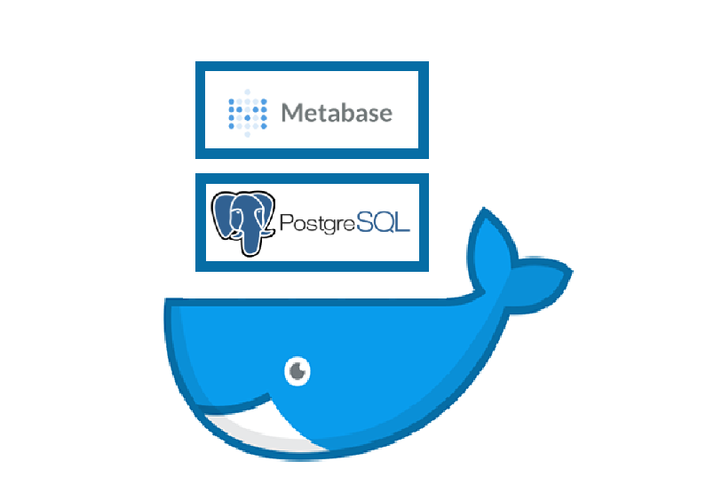

# postgres-docker-cluster-setup

## postgres info
- username: raywu
- password: raywu60kg
- database: world, metabase

## metabase info
- email: wuhaohsiang1992@gmail.com
- password: raywu60kg

## dataset
From the udemy course [Complete SQL + Databases Bootcamp: Zero to Mastery [2021]](https://www.udemy.com/course/complete-sql-databases-bootcamp-zero-to-mastery/)

## Reference
- https://code4projects.altervista.org/install-postgresql-cluster-docker/
- https://cloud.google.com/community/tutorials/setting-up-postgres-hot-standby
- https://github.com/paunin/PostDock
- https://www.udemy.com/course/complete-sql-databases-bootcamp-zero-to-mastery/